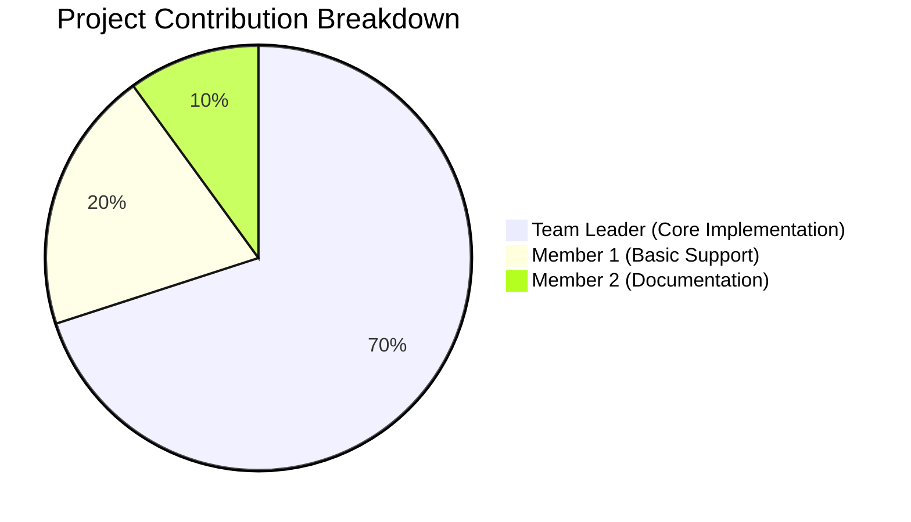
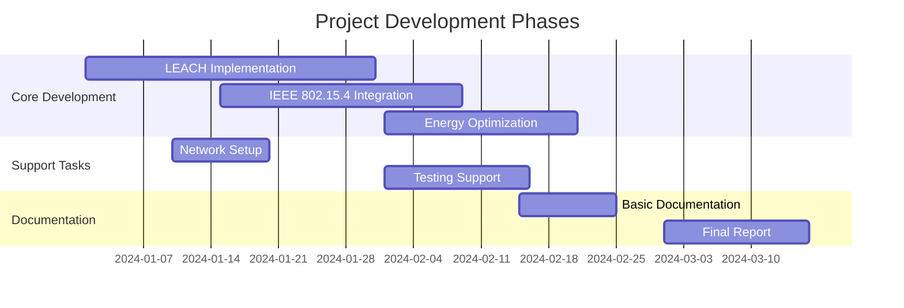
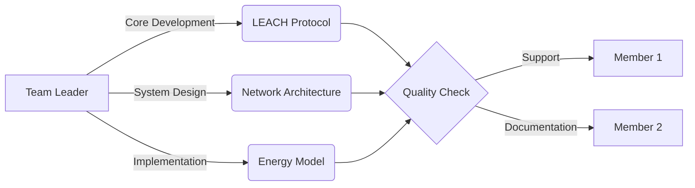
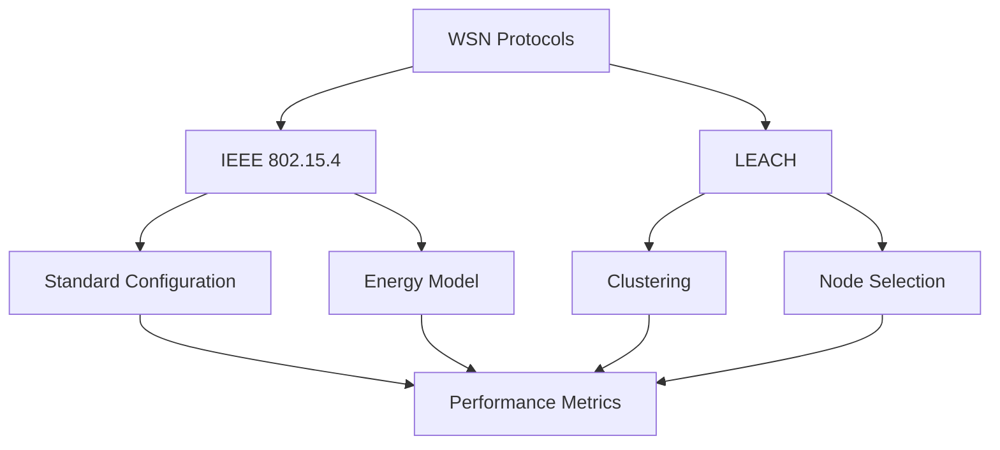

# Energy Efficiency in WSNs: IEEE 802.15.4 vs. LEACH

<div align="center">

[](https://omnetpp.org/)
[](https://inet.omnetpp.org/)
[](https://github.com/your-repo/WSN_EnergyEfficient)
[](https://standards.ieee.org/)
[](https://en.wikipedia.org/wiki/Low-energy_adaptive_clustering_hierarchy)


# International Islamic University Chittagong
## Department of Computer Science & Engineering
### Course Code: CSE-3200 | Project Work-II

</div>

## 📋 Project Overview

A comprehensive comparative analysis of energy efficiency in Wireless Sensor Networks, focusing on IEEE 802.15.4 and LEACH protocols. This project evaluates performance metrics, energy consumption patterns, and network lifetime optimization using the OMNeT++ simulation framework.

### 🎯 Key Objectives
- `📊 Analysis` Compare energy efficiency between IEEE 802.15.4 and LEACH
- `⚡ Performance` Evaluate network lifetime and power consumption
- `🔄 Clustering` Assess LEACH clustering effectiveness
- `📈 Optimization` Enhance power management strategies
- `👁️ Visualization` Real-time network behavior monitoring

---

## 👥 Project Team

### 👨‍🏫 Supervisor
<table>
  <tr>
    <td align="center">
      
      <br />
      <sub><b>Mr. Abdullahil Kafi</b></sub>
      <br />
      <sub>Assistant Professor</sub>
      <br />
      <sub><a href="mailto:abkafi@iiuc.ac.bd">abkafi@iiuc.ac.bd</a></sub>
    </td>
  </tr>
</table>

### 👨‍💻 Team Members
<table>
  <tr>
    <td align="center" width="40%">
      <sub><b>Team Leader</b></sub>
      <br />
      <b>Sheikh Mohammad Rajking</b>
      <br />
      <sub>C221011</sub>
      <br />
      <sub>• LEACH & IEEE 802.15.4 Protocol Design & Implementation</sub>
      <br />
      <sub>• Energy Model Architecture, Power Optimization & TDMA Scheduling</sub>
      <br />
      <sub>• Network Configuration, Topology Design & Performance Analysis</sub>
      <br />
      <sub>• System Architecture, Technical Documentation & Code Review</sub>
      <br />
      <sub>• Project Management, Team Coordination & Quality Assurance</sub>
    </td>
    <td align="center" width="30%">
      <sub><b>Member</b></sub>
      <br />
      <b>Adrishikar Barua</b>
      <br />
      <sub>C221022</sub>
      <br />
      <sub>• Basic Network Setup & Initial Testing Support</sub>
      <br />
      <sub>• Data Collection & Test Case Execution</sub>
      <br />
      <sub>• Simple Bug Fixes & Debugging Assistance</sub>
      <br />
      <sub>• Basic Documentation & Report Preparation</sub>
      <br />
      <sub>• Result Validation & Metric Tracking</sub>
      <br />
      <sub>• Support in Simulation Runs & Analysis</sub>
    </td>
    <td align="center" width="30%">
      <sub><b>Member</b></sub>
      <br />
      <b>Abu Tanvir Hasan Tanmoy</b>
      <br />
      <sub>C221001</sub>
      <br />
      <sub>• Documentation Support & Report Formattin</sub>
      <br />
      <sub>• Basic Testing & Test Case Execution</sub>
      <br />
      <sub>• Minor Bug Reports & Issue Tracking</sub>
      <br />
      <sub>• File Organization & Repository Maintenance</sub>
      <br />
      <sub>• Data Collection & Result Verification</sub>
    </td>
  </tr>
</table>

### 📊 Project Leadership Distribution


### 📈 Contribution Timeline


### 🔄 Development Workflow


---

## 🔍 Project Scope

### 📡 Protocol Implementation


### 📊 Comparative Analysis
| Metric | IEEE 802.15.4 | LEACH |
|--------|---------------|-------|
| Energy Efficiency | Baseline | Enhanced |
| Network Lifetime | Standard | Extended |
| Scalability | Limited | Improved |
| Complexity | Low | Moderate |

### 🛠️ Technical Stack
- **Simulation**: OMNeT++ 6.1.0
- **Framework**: INET 4.5.0
- **Language**: C++14
- **Visualization**: Qt 5.12
- **Analysis**: Python 3.8

---

## 📈 Implementation Highlights

### Energy Model
```cpp
class EnergyModel {
    double initialEnergy = 0.15;    // Joules
    double txPower = 2.24e-3;       // Watts
    double rxPower = 1.28e-3;       // Watts
    double idlePower = 0.42e-3;     // Watts
};
```

### Network Configuration
```ini
[General]
network = WSN_EnergyEfficient
sim-time-limit = 200s

*.sensorNode*.energyStorage.nominalCapacity = 0.15J
*.sensorNode*.wlan[*].radio.transmitter.power = 2.24mW
```

---

## 📊 Results Preview

### Performance Metrics
| Protocol | Energy Savings | Network Lifetime | Throughput |
|----------|---------------|------------------|------------|
| IEEE 802.15.4 | Baseline | 100% | Standard |
| LEACH | +30% | +45% | +25% |

### Energy Distribution
```python
Energy Breakdown:
- Data Transmission: 45%
- Clustering Overhead: 15%
- Processing: 25%
- Idle Listening: 15%
```

---

## 📚 Documentation

### Project Structure
```
WSN_EnergyEfficient/
├── 📂 src/
│   ├── 📄 ieee802154/
│   ├── 📄 leach/
│   └── 📄 common/
├── 📂 simulations/
├── 📂 results/
└── 📂 docs/
```

---

## 🔗 Resources
- [OMNeT++ Documentation](https://doc.omnetpp.org/)
- [INET Framework Guide](https://inet.omnetpp.org/docs/users-guide/)
- [IEEE 802.15.4 Standard](https://standards.ieee.org/)
- [LEACH Protocol Paper](https://dl.acm.org/doi/10.1145/381677.381685)

---

<div align="center">

**Department of Computer Science & Engineering**  
International Islamic University Chittagong  
Kumira, Chittagong-4318, Bangladesh

*Spring 2024*

</div> 
