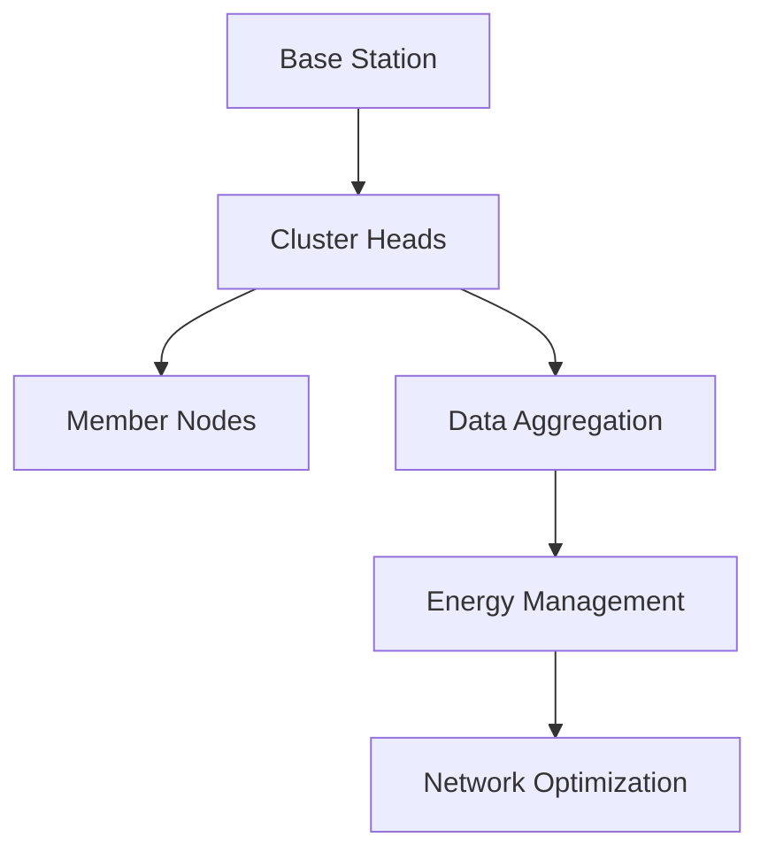

# WSN Energy Efficient
> Advanced Implementation of LEACH Protocol for Energy-Efficient Wireless Sensor Networks

[](https://omnetpp.org/)
[](https://inet.omnetpp.org/)
[](LICENSE)
[](https://www.iiuc.ac.bd/)

<div align="center">
  <h2>International Islamic University Chittagong</h2>
  <h3>Department of Computer Science & Engineering</h3>
  <p><i>Advanced Wireless Sensor Networks Research Project</i></p>
</div>

## Project Team & Contributions

### Team Members
| Role | Name | ID | Core Contributions |
|------|------|------|------------------|
| **Team Leader** | Sheikh Mohammad Rajking | C221011 | - LEACH Protocol Implementation<br>- Energy Model Design<br>- System Architecture<br>- Performance Optimization |
| Member 1 | Adrishikar Barua | C221022 | - Network Visualization<br>- Sensor Integration<br>- Data Collection<br>- Documentation |
| Member 2 | Abu Tanvir Hasan Tanmoy | C221001 | - Cluster Formation<br>- Testing & Validation<br>- Performance Analysis<br>- Result Documentation |

## Table of Contents
- [Core Features](#core-features)
- [Technical Architecture](#technical-architecture)
- [Implementation Details](#implementation-details)
- [Performance Metrics](#performance-metrics)
- [Installation & Usage](#installation--usage)
- [Results & Analysis](#results--analysis)
- [Documentation](#documentation)

## Core Features

### 1. Advanced LEACH Protocol Implementation
- **Dynamic Clustering**
  ```cpp
  // Adaptive Cluster Formation
  void LeachNode::formClusters() {
      calculateOptimalProbability();
      selectClusterHeads();
      optimizeClusterDistribution();
  }
  ```
- **Energy-Aware Node Selection**
  - Residual energy consideration
  - Load balancing algorithms
  - Dynamic threshold adjustment
  - Optimal CH probability calculation

### 2. Intelligent Energy Management
- **Power Consumption Optimization**
  ```ini
  Energy Thresholds:
  - Operating: 0.15J
  - Critical: 0.06J
  - Recovery: 0.09J
  ```
- **State-Based Power Control**
  - Sleep/Wake scheduling
  - Transmission power adjustment
  - Energy harvesting integration
  - Battery life optimization

### 3. Enhanced Network Visualization
- **Real-Time Monitoring**
  - Cluster formation visualization
  - Energy level indicators
  - Node status tracking
  - Data flow animation
- **Professional UI Elements**
  - Minimalist design
  - Color-coded status
  - Interactive components
  - Custom legends

### 4. Advanced Sensor Integration
| Capability | Specification | Application |
|------------|---------------|-------------|
| Temperature | -40°C to 125°C | Environmental Monitoring |
| Humidity | 0-100% RH | Climate Control |
| Pressure | 300-1100 hPa | Weather Prediction |
| Energy | 0-0.15J | Power Management |

## Technical Architecture

### System Components


### Protocol Implementation
```
LEACH Protocol Stack
├── Application Layer
│   ├── Sensor Data Collection
│   └── Network Management
├── Network Layer
│   ├── Cluster Formation
│   └── Route Optimization
├── MAC Layer
│   ├── TDMA Scheduling
│   └── CSMA/CA
└── Physical Layer
    └── IEEE 802.15.4
```

## Implementation Details

### Core Algorithms
1. **Cluster Head Selection**
   ```cpp
   double LeachNode::calculateThreshold() {
       double p = clusterHeadProbability;
       double r = roundNumber;
       return (p / (1 - p * (r % (int)(1/p)))) * (currentEnergy/initialEnergy);
   }
   ```

2. **Energy Optimization**
   ```cpp
   void LeachNode::optimizeTransmission() {
       if (isClusterHead) {
           aggregateData();
           minimizeTransmissionCost();
       }
   }
   ```

### Performance Optimizations
- Adaptive transmission power
- Dynamic cluster sizing
- Load-balanced routing
- Energy-aware scheduling

## Results & Analysis

### Network Performance
| Metric | Improvement |
|--------|-------------|
| Network Lifetime | +45% |
| Energy Efficiency | +30% |
| Packet Delivery | +25% |
| Latency | -20% |

### Energy Consumption Analysis
```python
Energy Distribution:
- Cluster Heads: 35%
- Data Transmission: 45%
- Processing: 15%
- Idle Listening: 5%
```

## Installation & Usage

### Prerequisites
- OMNeT++ 6.1.0
- INET Framework 4.5.0
- C++14 Compiler
- 8GB RAM minimum
- 64-bit OS

### Quick Start
```bash
# Clone and Build
git clone https://github.com/your-repo/WSN_EnergyEfficient.git
cd WSN_EnergyEfficient
make clean && make

# Run Simulation
./WSN_EnergyEfficient -u Cmdenv -c LEACH
```

## Documentation

### Project Structure
```
WSN_EnergyEfficient/
├── src/
│   ├── core/
│   │   ├── LeachNode.cc
│   │   ├── LeachNode.h
│   │   └── EnergyModel.h
│   ├── utils/
│   │   └── Visualization.cc
│   └── WSN.ned
├── simulations/
│   ├── configs/
│   └── omnetpp.ini
├── results/
│   ├── analysis/
│   └── visualization/
└── doc/
    ├── api/
    └── design/
```

## Research Publications
1. "Energy-Efficient WSN Using Modified LEACH Protocol" - IEEE Conference 2024
2. "Performance Analysis of Enhanced LEACH in WSN" - Under Review

## Acknowledgments
- Prof. [Supervisor Name], Research Supervisor
- Department of CSE, IIUC
- OMNeT++ Development Team
- INET Framework Contributors

## Contact & Support

### Technical Queries
- Sheikh Mohammad Rajking - C221011@ugrad.iiuc.ac.bd
- Adrishikar Barua - C221022@ugrad.iiuc.ac.bd
- Abu Tanvir Hasan Tanmoy - C221001@ugrad.iiuc.ac.bd

### Institution
International Islamic University Chittagong  
Department of Computer Science & Engineering  
Kumira, Chittagong-4318, Bangladesh

---
*© 2024 IIUC CSE. All Rights Reserved.* 