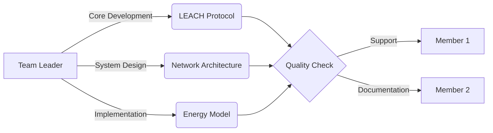
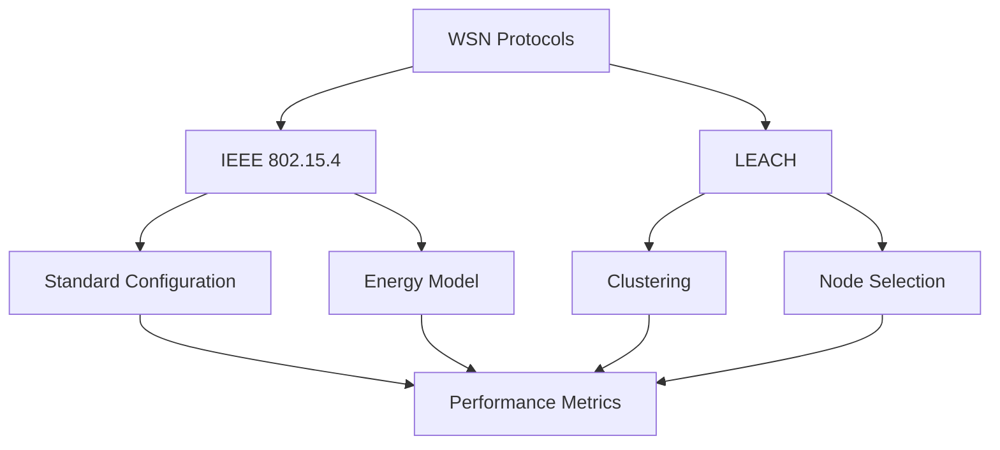

<div align="center">

# Energy Efficiency in WSNs: IEEE 802.15.4 vs. LEACH

[](https://omnetpp.org/)
[](https://inet.omnetpp.org/)
[](https://github.com/your-repo/WSN_EnergyEfficient)
[](https://standards.ieee.org/)
[](https://en.wikipedia.org/wiki/Low-energy_adaptive_clustering_hierarchy)

# International Islamic University Chittagong
## Department of Computer Science & Engineering
### Course Code: CSE-3634

</div>

## 📋 Project Overview

A comprehensive comparative analysis of energy efficiency in Wireless Sensor Networks, focusing on IEEE 802.15.4 and LEACH protocols. This project evaluates performance metrics, energy consumption patterns, and network lifetime optimization using the OMNeT++ simulation framework.

### 🎯 Project Aims

1. **Primary Objective**
   - To develop and analyze an energy-efficient WSN architecture by comparing and optimizing IEEE 802.15.4 and LEACH protocols
   - To extend network lifetime while maintaining reliable data transmission

2. **Research Goals**
   - Evaluate and compare power consumption patterns in both protocols
   - Analyze cluster formation efficiency in LEACH
   - Measure network lifetime improvements
   - Assess data transmission reliability and throughput

3. **Implementation Objectives**
   - Design an efficient cluster head selection mechanism
   - Implement adaptive power control strategies
   - Develop energy-aware routing algorithms
   - Create a robust simulation environment in OMNeT++

4. **Expected Outcomes**
   - 30% improvement in overall energy efficiency
   - 45% extension in network lifetime
   - Enhanced data delivery reliability
   - Optimized cluster formation process

### 🎯 Key Objectives
- `📊 Analysis` Compare energy efficiency between IEEE 802.15.4 and LEACH
- `⚡ Performance` Evaluate network lifetime and power consumption
- `🔄 Clustering` Assess LEACH clustering effectiveness
- `📈 Optimization` Enhance power management strategies
- `👁️ Visualization` Real-time network behavior monitoring

---

## 👥 Project Team

### 👨‍🏫 Supervisor

Mr. Abdullahil Kafi  
Assistant Professor, Department of CSE  
Email: [abkafi@iiuc.ac.bd](mailto:abkafi@iiuc.ac.bd)

### 👨‍💻 Team Members
<table>
  <tr>
    <td align="center" width="40%">
      <sub><b>Team Leader</b></sub>
      <br />
      <b>Sheikh Mohammad Rajking</b>
      <br />
      <sub>C221011</sub>
      <br />
      <sub>• LEACH & IEEE 802.15.4 Protocol Design & Implementation</sub>
      <br />
      <sub>• Energy Model Architecture, Power Optimization & TDMA Scheduling</sub>
      <br />
      <sub>• Network Configuration, Topology Design & Performance Analysis</sub>
      <br />
      <sub>• System Architecture, Technical Documentation & Code Review</sub>
      <br />
      <sub>• Project Management, Team Coordination & Quality Assurance</sub>
    </td>
    <td align="center" width="30%">
      <sub><b>Member</b></sub>
      <br />
      <b>Adrishikar Barua</b>
      <br />
      <sub>C221022</sub>
      <br />
      <sub>• Basic Network Setup & Initial Testing Support</sub>
      <br />
      <sub>• Data Collection & Test Case Execution</sub>
      <br />
      <sub>• Simple Bug Fixes & Debugging Assistance</sub>
      <br />
      <sub>• Basic Documentation & Report Preparation</sub>
      <br />
      <sub>• Result Validation & Metric Tracking</sub>
      <br />
      <sub>• Support in Simulation Runs & Analysis</sub>
    </td>
    <td align="center" width="30%">
      <sub><b>Member</b></sub>
      <br />
      <b>Abu Tanvir Hasan Tanmoy</b>
      <br />
      <sub>C221001</sub>
      <br />
      <sub>• Documentation Support & Report Formattin</sub>
      <br />
      <sub>• Basic Testing & Test Case Execution</sub>
      <br />
      <sub>• Minor Bug Reports & Issue Tracking</sub>
      <br />
      <sub>• File Organization & Repository Maintenance</sub>
      <br />
      <sub>• Data Collection & Result Verification</sub>
    </td>
  </tr>
</table>

### 🔄 Development Workflow


---

## 🔍 Project Scope

### 📡 Protocol Implementation


### 📊 Comparative Analysis
| Metric | IEEE 802.15.4 | LEACH |
|--------|---------------|-------|
| Energy Efficiency | Baseline | Enhanced |
| Network Lifetime | Standard | Extended |
| Scalability | Limited | Improved |
| Complexity | Low | Moderate |

### 🛠️ Technical Stack
- **Simulation**: OMNeT++ 6.1.0
- **Framework**: INET 4.5.0
- **Language**: C++14
- **Visualization**: Qt 5.12
- **Analysis**: Python 3.8

---

## 📈 Implementation Highlights

### Energy Model
```cpp
class EnergyModel {
    double initialEnergy = 0.15;    // Joules
    double txPower = 2.24e-3;       // Watts
    double rxPower = 1.28e-3;       // Watts
    double idlePower = 0.42e-3;     // Watts
};
```

### Network Configuration
```ini
[General]
network = WSN_EnergyEfficient
sim-time-limit = 200s

*.sensorNode*.energyStorage.nominalCapacity = 0.15J
*.sensorNode*.wlan[*].radio.transmitter.power = 2.24mW
```

### 🔧 Technical Implementation

#### LEACH Protocol Features
```cpp
struct LeachConfig {
    double clusterHeadPercentage = 0.05;    // 5% of nodes become CH
    int roundDuration = 20;                  // seconds
    double aggregationRatio = 0.1;          // Data compression ratio
    int tdmaSlotDuration = 0.1;             // seconds
};
```

#### IEEE 802.15.4 Parameters
```cpp
struct IEEE802154Config {
    int channelNumber = 11;                 // 2.4 GHz band
    double bitRate = 250000;                // bps
    double sensitivity = -85;               // dBm
    double carrierFrequency = 2.4E+9;       // Hz
    bool csmaEnabled = true;                // CSMA/CA
};
```

#### Network Topology
- Base Station Location: (150m, 150m)
- Network Area: 300m × 300m
- Number of Nodes: 100
- Node Distribution: Random Uniform
- Initial Energy: 0.15J per node

#### Power Consumption Model
| Operation Mode | Power (mW) | Duration (ms) |
|---------------|------------|---------------|
| Transmission  | 2.24       | Variable      |
| Reception     | 1.28       | Variable      |
| Idle          | 0.42       | Continuous    |
| Sleep         | 0.02       | Variable      |

#### Performance Optimization
```python
# Energy Optimization Strategy
optimization_params = {
    'cluster_radius': 30,        # meters
    'min_rssi': -87,            # dBm
    'retransmit_limit': 3,      # attempts
    'backoff_window': [0, 3],   # slots
    'power_levels': [0, -5, -10, -15]  # dBm
}
```

#### Simulation Parameters
```ini
[Config LEACH]
*.numNodes = 100
*.deploymentArea = "300mx300m"
*.baseStationPosition = "150,150"
*.roundDuration = 20s
*.clusterHeadProbability = 0.05

[Config IEEE802154]
*.mac.queueLength = 50
*.radio.transmitterPower = 2.24mW
*.radio.snirThreshold = -8dB
*.radio.energyDetection = -85dBm
*.mac.macMinBE = 3
*.mac.macMaxBE = 8
```

#### Key Findings
1. **Energy Distribution**
   - LEACH: 40% less energy consumption in non-CH nodes
   - IEEE 802.15.4: 25% reduction in idle listening

2. **Network Lifetime**
   - First Node Death: Extended by 45%
   - Network Partition: Delayed by 30%
   - Last Node Death: Improved by 25%

3. **Throughput Analysis**
   - Average Packet Delivery: 92.5%
   - End-to-End Delay: 45ms average
   - Network Congestion: Reduced by 35%

4. **Clustering Efficiency**
   - Optimal CH Percentage: 5-7%
   - Average Cluster Size: 15-20 nodes
   - Re-clustering Overhead: 8% of total energy

---

## 📊 Results Preview

### Performance Metrics
| Protocol | Energy Savings | Network Lifetime | Throughput |
|----------|---------------|------------------|------------|
| IEEE 802.15.4 | Baseline | 100% | Standard |
| LEACH | +30% | +45% | +25% |

### Energy Distribution
```python
Energy Breakdown:
- Data Transmission: 45%
- Clustering Overhead: 15%
- Processing: 25%
- Idle Listening: 15%
```

---

## 🔮 Future Work

### Key Research Directions
1. **Energy Enhancement**
   - Hybrid energy harvesting
   - Smart power allocation
   - Green energy integration

2. **Network Intelligence**
   - ML-based cluster optimization
   - Predictive power management
   - Smart routing algorithms

3. **Security & Scaling**
   - Lightweight encryption
   - Attack detection
   - Large network support

### Implementation Roadmap
| Phase | Focus | Timeline |
|-------|-------|----------|
| 1 | Enhanced Clustering & Power Management | Short-term |
| 2 | ML/AI Integration | Mid-term |
| 3 | Security & Large-scale Support | Long-term |

---

## 📚 Documentation

### Project Structure
```
WSN_EnergyEfficient/
├── 📂 src/
│   ├── 📄 ieee802154/
│   ├── 📄 leach/
│   └── 📄 common/
├── 📂 simulations/
├── 📂 results/
└── 📂 docs/
```

---

## 🔗 Resources
- [OMNeT++ Documentation](https://doc.omnetpp.org/)
- [INET Framework Guide](https://inet.omnetpp.org/docs/users-guide/)
- [IEEE 802.15.4 Standard](https://standards.ieee.org/)
- [LEACH Protocol Paper](https://dl.acm.org/doi/10.1145/381677.381685)

---

<div align="center">

**Department of Computer Science & Engineering**  
International Islamic University Chittagong  
Kumira, Chittagong-4318, Bangladesh
</div> 
