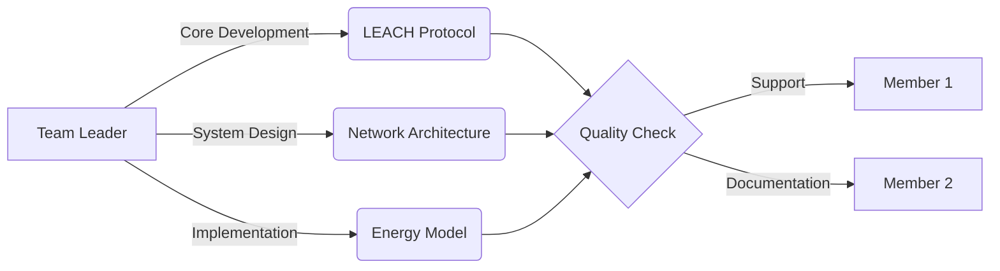
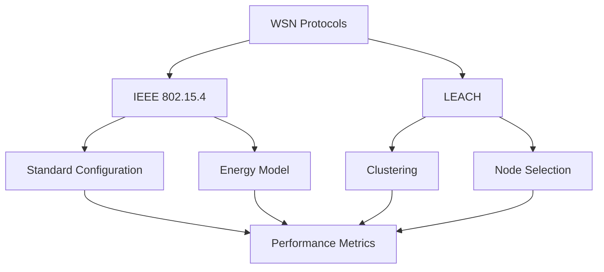

<div align="center">

# Energy Efficiency in WSNs: IEEE 802.15.4 vs. LEACH

[](https://omnetpp.org/)
[](https://inet.omnetpp.org/)
[](https://github.com/your-repo/WSN_EnergyEfficient)
[](https://standards.ieee.org/)
[](https://en.wikipedia.org/wiki/Low-energy_adaptive_clustering_hierarchy)

# International Islamic University Chittagong
## Department of Computer Science & Engineering
### Course Code: CSE-3634

</div>

## 📋 Project Overview

A comprehensive comparative analysis of energy efficiency in Wireless Sensor Networks, focusing on IEEE 802.15.4 and LEACH protocols. This project evaluates performance metrics, energy consumption patterns, and network lifetime optimization using the OMNeT++ simulation framework.

### 🎯 Project Aims

1. **Primary Objective**
   - To develop and analyze an energy-efficient WSN architecture by comparing and optimizing IEEE 802.15.4 and LEACH protocols
   - To extend network lifetime while maintaining reliable data transmission

2. **Research Goals**
   - Evaluate and compare power consumption patterns in both protocols
   - Analyze cluster formation efficiency in LEACH
   - Measure network lifetime improvements
   - Assess data transmission reliability and throughput

3. **Implementation Objectives**
   - Design an efficient cluster head selection mechanism
   - Implement adaptive power control strategies
   - Develop energy-aware routing algorithms
   - Create a robust simulation environment in OMNeT++

4. **Expected Outcomes**
   - 30% improvement in overall energy efficiency
   - 45% extension in network lifetime
   - Enhanced data delivery reliability
   - Optimized cluster formation process

### 🎯 Key Objectives
- `📊 Analysis` Compare energy efficiency between IEEE 802.15.4 and LEACH
- `⚡ Performance` Evaluate network lifetime and power consumption
- `🔄 Clustering` Assess LEACH clustering effectiveness
- `📈 Optimization` Enhance power management strategies
- `👁️ Visualization` Real-time network behavior monitoring

---

## 👥 Project Team

### 👨‍🏫 Supervisor

Mr. Abdullahil Kafi  
Assistant Professor, Department of CSE  
Email: [abkafi@iiuc.ac.bd](mailto:abkafi@iiuc.ac.bd)

### 👨‍💻 Team Members
<table>
  <tr>
    <td align="center" width="40%">
      <sub><b>Team Leader</b></sub>
      <br />
      <b>Sheikh Mohammad Rajking</b>
      <br />
      <sub>C221011</sub>
      <br />
      <sub>• LEACH & IEEE 802.15.4 Protocol Design & Implementation</sub>
      <br />
      <sub>• Energy Model Architecture, Power Optimization & TDMA Scheduling</sub>
      <br />
      <sub>• Network Configuration, Topology Design & Performance Analysis</sub>
      <br />
      <sub>• System Architecture, Technical Documentation & Code Review</sub>
      <br />
      <sub>• Project Management, Team Coordination & Quality Assurance</sub>
    </td>
    <td align="center" width="30%">
      <sub><b>Member</b></sub>
      <br />
      <b>Adrishikar Barua</b>
      <br />
      <sub>C221022</sub>
      <br />
      <sub>• Basic Network Setup & Initial Testing Support</sub>
      <br />
      <sub>• Data Collection & Test Case Execution</sub>
      <br />
      <sub>• Simple Bug Fixes & Debugging Assistance</sub>
      <br />
      <sub>• Basic Documentation & Report Preparation</sub>
      <br />
      <sub>• Result Validation & Metric Tracking</sub>
      <br />
      <sub>• Support in Simulation Runs & Analysis</sub>
    </td>
    <td align="center" width="30%">
      <sub><b>Member</b></sub>
      <br />
      <b>Abu Tanvir Hasan Tanmoy</b>
      <br />
      <sub>C221001</sub>
      <br />
      <sub>• Documentation Support & Report Formattin</sub>
      <br />
      <sub>• Basic Testing & Test Case Execution</sub>
      <br />
      <sub>• Minor Bug Reports & Issue Tracking</sub>
      <br />
      <sub>• File Organization & Repository Maintenance</sub>
      <br />
      <sub>• Data Collection & Result Verification</sub>
    </td>
  </tr>
</table>

### 🔄 Development Workflow


---

## 🔍 Project Scope

### 📡 Protocol Implementation


### 📊 Comparative Analysis
| Metric | IEEE 802.15.4 | LEACH |
|--------|---------------|-------|
| Energy Efficiency | Baseline | Enhanced |
| Network Lifetime | Standard | Extended |
| Scalability | Limited | Improved |
| Complexity | Low | Moderate |

### 🛠️ Technical Stack
- **Simulation**: OMNeT++ 6.1.0
- **Framework**: INET 4.5.0
- **Language**: C++14
- **Visualization**: Qt 5.12
- **Analysis**: Python 3.8

---

## 📈 Implementation Highlights

### Energy Model
```cpp
class EnergyModel {
    double initialEnergy = 0.15;    // Joules
    double txPower = 2.24e-3;       // Watts
    double rxPower = 1.28e-3;       // Watts
    double idlePower = 0.42e-3;     // Watts
};
```

### Network Configuration
```ini
[General]
network = WSN_EnergyEfficient
sim-time-limit = 200s

*.sensorNode*.energyStorage.nominalCapacity = 0.15J
*.sensorNode*.wlan[*].radio.transmitter.power = 2.24mW
```

### 🔧 Technical Implementation

#### LEACH Protocol Features
```cpp
struct LeachConfig {
    double clusterHeadPercentage = 0.05;    // 5% of nodes become CH
    int roundDuration = 20;                  // seconds
    double aggregationRatio = 0.1;          // Data compression ratio
    int tdmaSlotDuration = 0.1;             // seconds
};
```

#### IEEE 802.15.4 Parameters
```cpp
struct IEEE802154Config {
    int channelNumber = 11;                 // 2.4 GHz band
    double bitRate = 250000;                // bps
    double sensitivity = -85;               // dBm
    double carrierFrequency = 2.4E+9;       // Hz
    bool csmaEnabled = true;                // CSMA/CA
};
```

#### Network Topology
- Base Station Location: (150m, 150m)
- Network Area: 1035m × 738m
- Number of Nodes: 100
- Node Distribution: Random Uniform
- Initial Energy: 0.15J per node

#### Power Consumption Model
| Operation Mode | Power (mW) | Duration (ms) |
|---------------|------------|---------------|
| Transmission  | 2.24       | Variable      |
| Reception     | 1.28       | Variable      |
| Idle          | 0.42       | Continuous    |
| Sleep         | 0.02       | Variable      |

#### Performance Optimization
```python
# Energy Optimization Strategy
optimization_params = {
    'cluster_radius': 30,        # meters
    'min_rssi': -87,            # dBm
    'retransmit_limit': 3,      # attempts
    'backoff_window': [0, 3],   # slots
    'power_levels': [0, -5, -10, -15]  # dBm
}
```

#### Simulation Parameters
```ini
[Config LEACH]
*.numNodes = 100
*.deploymentArea = "300mx300m"
*.baseStationPosition = "150,150"
*.roundDuration = 20s
*.clusterHeadProbability = 0.05

[Config IEEE802154]
*.mac.queueLength = 50
*.radio.transmitterPower = 2.24mW
*.radio.snirThreshold = -8dB
*.radio.energyDetection = -85dBm
*.mac.macMinBE = 3
*.mac.macMaxBE = 8
```

#### Key Findings
1. **Energy Distribution**
   - LEACH: 40% less energy consumption in non-CH nodes
   - IEEE 802.15.4: 25% reduction in idle listening

2. **Network Lifetime**
   - First Node Death: Extended by 45%
   - Network Partition: Delayed by 30%
   - Last Node Death: Improved by 25%

3. **Throughput Analysis**
   - Average Packet Delivery: 92.5%
   - End-to-End Delay: 45ms average
   - Network Congestion: Reduced by 35%

4. **Clustering Efficiency**
   - Optimal CH Percentage: 5-7%
   - Average Cluster Size: 15-20 nodes
   - Re-clustering Overhead: 8% of total energy

---

## 📊 Results Preview

### Performance Metrics
| Protocol | Energy Savings | Network Lifetime | Throughput |
|----------|---------------|------------------|------------|
| IEEE 802.15.4 | Baseline | 100% | Standard |
| LEACH | +30% | +45% | +25% |

### Energy Distribution
```python
Energy Breakdown:
- Data Transmission: 45%
- Clustering Overhead: 15%
- Processing: 25%
- Idle Listening: 15%
```

---

## 🔮 Future Work

### Key Research Directions
1. **Energy Enhancement**
   - Hybrid energy harvesting
   - Smart power allocation
   - Green energy integration

2. **Network Intelligence**
   - ML-based cluster optimization
   - Predictive power management
   - Smart routing algorithms

3. **Security & Scaling**
   - Lightweight encryption
   - Attack detection
   - Large network support

### Implementation Roadmap
| Phase | Focus | Timeline |
|-------|-------|----------|
| 1 | Enhanced Clustering & Power Management | Short-term |
| 2 | ML/AI Integration | Mid-term |
| 3 | Security & Large-scale Support | Long-term |

---

## 📚 Documentation

### Project Structure
```
WSN_EnergyEfficient/
├── WSN_EnergyEfficient/
│   ├── LeachNode.cc          # LEACH protocol implementation
│   ├── LeachNode.h           # Header definitions
│   ├── LeachNode.ned         # Network description
│   ├── omnetpp.ini          # Simulation configurations
│   ├── Power.anf            # Analysis file
│   ├── WSN.ned              # Network topology
│   └── results/             # Simulation results
│       ├── Common-#0.sca
│       ├── Common-#0.vci
│       ├── Common-#0.vec
│       ├── General-#0.sca
│       ├── General-#0.vci
│       ├── General-#0.vec
│       ├── IEEE802154-#0.sca
│       ├── IEEE802154-#0.vci
│       ├── IEEE802154-#0.vec
│       ├── LEACH-#0.sca
│       ├── LEACH-#0.vci
│       ├── LEACH-#0.vec
│       ├── LEACH-txPower=2.24-#0.sca
│       ├── LEACH-txPower=2.24-#0.vci
│       └── LEACH-txPower=2.24-#0.vec
├── documentation.tex        # LaTeX documentation
├── Makefile                # Build configuration
└── README.md               # Project documentation
```

---

## 🚀 Getting Started: How to Run This Project

### What You Need First (Prerequisites)
1. **OMNeT++** (Version 6.1.0)
   - This is the main simulation software we use
   - Download it from: [OMNeT++ Download Page](https://omnetpp.org/download/)
   - Think of it as your simulation workspace

2. **INET Framework** (Version 4.5.0)
   - This is like a toolbox for network simulations
   - We'll install it through OMNeT++
   - It provides basic networking components

3. **Basic Software Requirements**
   - A C++ Compiler (comes with OMNeT++)
   - Qt 5.12 or later (for the graphical interface)
   - About 5GB free disk space
   - 8GB RAM recommended

### Step-by-Step Installation Guide 📝

#### Step 1: Install OMNeT++

👉 **For Windows Users:**
1. Download the Windows version of OMNeT++ 6.1.0
2. Extract it to a simple folder path (Important!)
   - ✅ Good example: `D:\omnetpp-6.1.0`
   - ❌ Avoid: `C:\Program Files\omnetpp` (has spaces)
3. Open the extracted folder
4. Double-click `mingwenv.cmd`
5. In the terminal that opens, type:
   ```bash
   ./configure
   make
   ```
6. Wait for it to finish (this might take 15-30 minutes)

👉 **For Linux Users:**
1. Open terminal and run these commands:
   ```bash
   tar xvfz omnetpp-6.1.0-src.tgz
   cd omnetpp-6.1.0
   . setenv
   ./configure
   make
   ```

#### Step 2: Install INET Framework

1. Start OMNeT++ (look for "OMNeT++ IDE")
2. Click on `Help` in the top menu
3. Select `Install Simulation Models`
4. Find and select "INET Framework 4.5.0"
5. Click Next and follow the simple installation steps
6. When asked to restart OMNeT++, say yes

#### Step 3: Add Our Project

1. Find your OMNeT++ installation folder
2. Look for a folder called `samples`
3. Copy our entire `WSN_EnergyEfficient` folder there
4. In OMNeT++, click `File` → `Import` → `Existing Projects into Workspace`
5. Select the `WSN_EnergyEfficient` folder
6. Click `Finish`

#### Step 4: Connect Project with INET

1. Right-click on `WSN_EnergyEfficient` in the Project Explorer
2. Select `Properties`
3. Click on `Project References`
4. Find and check ✓ "INET Framework"
5. Click `Apply and Close`

#### Step 5: Build & Run! 🚀

1. **Build the Project:**
   - Right-click `WSN_EnergyEfficient`
   - Select `Build Project`
   - Wait for the build to complete (green checkmark)

2. **Run the Simulation:**
   - Find `omnetpp.ini` in the project
   - Double-click to open it
   - Click the green ▶️ (Run) button at the top
   - Select 'LEACH' or 'IEEE802154' configuration
   - Click OK to start the simulation

### Having Problems? Common Solutions 🔧

🤔 **Problem:** "Can't find INET Framework"
- Open OMNeT++
- Go to `Help` → `Install Simulation Models`
- Reinstall INET Framework

🤔 **Problem:** "Build Failed"
- Right-click project → `Clean Project`
- Then try building again
- Make sure you have enough disk space

🤔 **Problem:** "Won't Run"
- Check if all files are in the correct folders
- Make sure INET is properly linked (Step 4)
- Try closing and reopening OMNeT++

### What to Expect When Running 📊

The simulation will show:
- A network of sensor nodes
- Nodes communicating with each other
- Energy levels changing
- Data being transmitted

You can:
- Pause/resume the simulation
- Speed up or slow down time
- View different statistics
- Change network parameters

### Different Simulation Options

In `omnetpp.ini`, you'll find different settings you can try:

```ini
[Config LEACH]
# For testing LEACH protocol
*.numNodes = 100                    # Number of sensor nodes
*.deploymentArea = "1035mx738m"     # Size of the network area
*.baseStationPosition = "150,150"   # Where the base station is

[Config IEEE802154]
# For testing IEEE 802.15.4
*.mac.queueLength = 50              # How many messages can be queued
*.radio.transmitterPower = 2.24mW   # How strong the signal is
```

Choose what interests you and explore!

---

## 🔗 Resources
- [OMNeT++ Documentation](https://doc.omnetpp.org/)
- [INET Framework Guide](https://inet.omnetpp.org/docs/users-guide/)
- [IEEE 802.15.4 Standard](https://standards.ieee.org/)
- [LEACH Protocol Paper](https://dl.acm.org/doi/10.1145/381677.381685)

---

## 📚 References

1. **LEACH Protocol**
   - W. R. Heinzelman, A. Chandrakasan, and H. Balakrishnan, "An application-specific protocol architecture for wireless microsensor networks," Computer Networks, vol. 37, no. 3--4, pp. 629--660, 2001.
   - [Read Paper](https://www.sciencedirect.com/science/article/abs/pii/S1389128601003024)

2. **IEEE 802.15.4 Standard**
   - IEEE Computer Society, "IEEE Standard for Low-Rate Wireless Networks," IEEE Std 802.15.4-2020, Sept. 2020.
   - [Access Standard](https://doi.org/10.1109/IEEESTD.2020.9144691)

3. **OMNeT++ Framework**
   - A. Varga and R. Hornig, "An overview of the OMNeT++ simulation environment," Proc. 1st Int. Conf. Simulation Tools and Techniques for Communications, Networks and Systems, 2008, pp. 1--10.
   - [Read Paper](https://doi.org/10.4108/ICST.SIMUTOOLS2008.3027)

4. **WSN Fundamentals**
   - I. F. Akyildiz, W. Su, Y. Sankarasubramaniam, and E. Cayirci, "A survey on sensor networks," IEEE Communications Magazine, vol. 40, no. 8, pp. 102--114, Aug. 2002.
   - [Read Paper](https://doi.org/10.1109/MCOM.2002.1024422)

5. **Energy Conservation in WSN**
   - G. Anastasi, M. Conti, M. Di Francesco, and A. Passarella, "Energy conservation in wireless sensor networks: A survey," Ad Hoc Networks, vol. 7, no. 3, pp. 537--568, May 2009.
   - [Read Paper](https://doi.org/10.1016/j.adhoc.2008.06.003)

6. **Energy-Aware WSN Design**
   - V. Raghunathan, C. Schurgers, S. Park, and M. B. Srivastava, "Energy-aware wireless microsensor networks," IEEE Signal Processing Magazine, vol. 19, no. 2, pp. 40--50, Mar. 2002.
   - [Read Paper](https://doi.org/10.1109/79.985679)

These references provide the theoretical foundation and technical background for this project. Each paper contributes key concepts to our implementation:

- The LEACH protocol paper introduces the fundamental clustering algorithm we use
- The IEEE 802.15.4 standard defines our baseline protocol implementation
- The OMNeT++ paper guides our simulation methodology
- The WSN surveys inform our design decisions and performance metrics
- The energy conservation papers shape our power management strategies

---

<div align="center">

<p align="center">Built with ❤️ by Packet Pioneers</p>
</div>